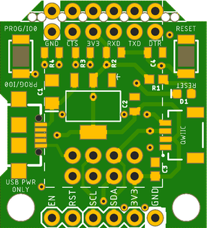
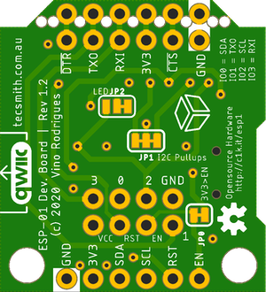

# ESP-01 Qwiic Development Board

An ESP-01 Development Board with power, programming and Qwiic headers

GitHub repository at [Tecsmith/arduino-esp-01-dev-board](https://github.com/Tecsmith/arduino-esp-01-dev-board/)


## Specifications

- Host of ESP-01 (or ESP-01S) module.
- Powered from USB Micro-B connector
- Serial programing breakout pins (for use with SparkFun [FTDI 3.3V Breakout](https://www.sparkfun.com/products/9873))
- I<sup>2</sup>C breakout pins (SCL, SDA, 3V3, GND)
- Qwiic connector (works with SparkFun's [Qwiic Connect System](https://www.sparkfun.com/qwiic))
- Tactile GPIO0 momentary button (press to set ESP8266 into programming mode while booting)
- Tactile RESET momentary button (press to reboot ESP8266)
- Unlike common designs, this uses GPIO-0/GPIO-2 for I<sup>2</sup>C, leaving TX/RX (GPIO-1/GPIO-3) available for serial debug.


## ESP-01 Pinout

DevBrd | ESP | Pin | Pin | ESP | DevBrd
---|---|---|---|---|---|
RXI / RXD | GPIO-3 / RX | **5** | **4** | VCC (3.3V) | 3V3
SCL / [*Prog/IO0*] | GPIO-0 | **6** | **3** | RST | [*Reset*]
SDA | GPIO-2 | **7** | **2** | CH_PD / EN | EN / Enable
GND | GND | **8** | **1** | GPIO-1 / TX | TXO / TXD

#### Sequence for placing EPS-01 in programing mode

1. Press and hold [*Reset*] button.
2. Press and hold [*Prog/IO0*] button.
3. Release [*Reset*] button
4. Wait 1 sec.
5. Pelease [*Prog/IO0*] - EPS-01 is now in "boot loader" mode.
6. *Perform upload code tasks*
7. Press and release [*Reset*] button to revert to run mode.


## On Board Jumpers

### JP1 - I<sup>2</sup>C Pull Ups
- Connected _(default)_: 4.7KΩ pullups
- Cut both sides: No pullups

### JP2 - LED

As seen from the bottom:

- Tied to right (pin 2-3): LED ground to GND, always ON to show power state _(Default)_
- Tied to left (pin 1-2): LED ground to GPIO2 (as ESP-01 does) to show GPIO2 state when pulled low.
- Both cut: LED disabled


## Manufacturing

* Schematic print: [esp-01-qwiic-devbrd-v1.2.pdf](esp-01-qwiic-devbrd-v1.2.pdf)
* Schematic source (in EAGLE): [Tecsmith/arduino-esp-01-dev-board/EAGLE/esp-01-qwiic-devbrd-v1.2.sch](https://github.com/Tecsmith/arduino-esp-01-dev-board/blob/main/EAGLE/esp-01-qwiic-devbrd-v1.2.sch)
* PCB design (in EAGLE): [Tecsmith/arduino-esp-01-dev-board/EAGLE/esp-01-qwiic-devbrd-v1.2.brd](https://github.com/Tecsmith/arduino-esp-01-dev-board/blob/main/EAGLE/esp-01-qwiic-devbrd-v1.2.brd)


<p align="center">
  
  &nbsp;
  
  <br>
  2<sup>nd</sup> prototype built by JCLPCB
</p>


## Source Code

No source code is provided for the ESP-01, this is just a break out board that allows the ESP-01 to be used easily in a development environment and in some production cases.

Personaly I've been using [arendst/Tasmota](https://github.com/arendst/tasmota/) for MQTT integration, but the I2C on this board does ***not*** work on Tasmota base code.

Its important to note that most base code for the ESP8266 uses GPIOs 4 and 5 for I2C (as these are the manufacturers default), but the the ESP-01 board does not expose IOs 4 and 5.  This project uses GPIOs 0 and 2 for I2C (0 = SDA, 2 = SCL) and the Wire library needs to be initialised with the following code:

```cpp
// in header
#define SDA_PIN 0
#define SCL_PIN 2

// in setup()
Wire.begin(SDA_PIN, SCL_PIN);
```


<p align="center" style="color:#069">★</p>
